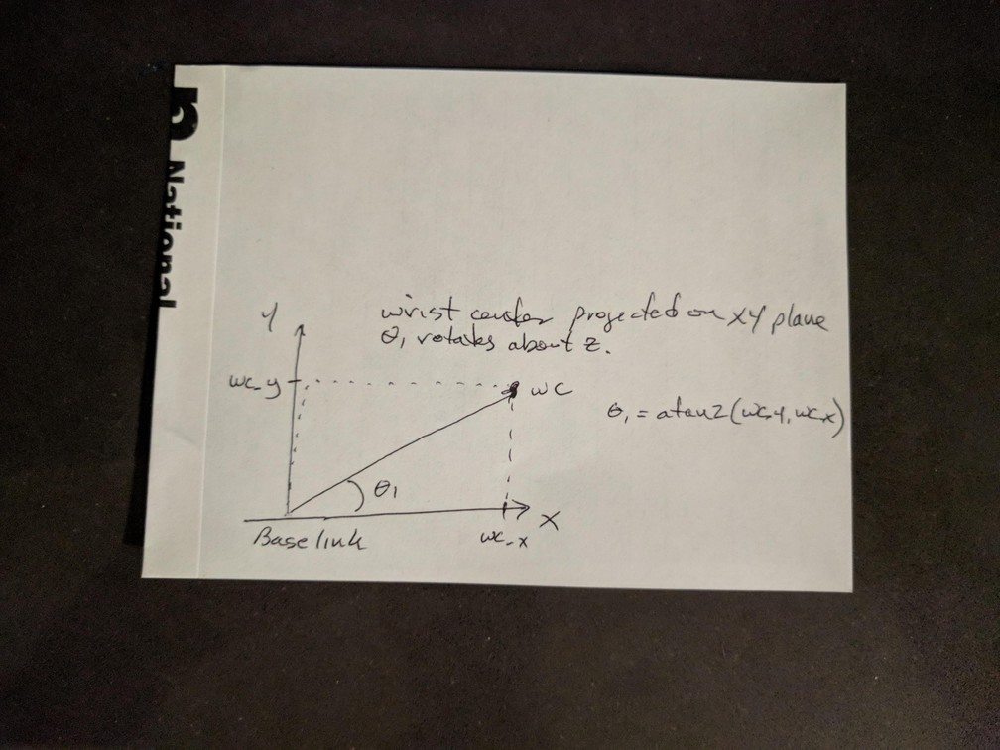
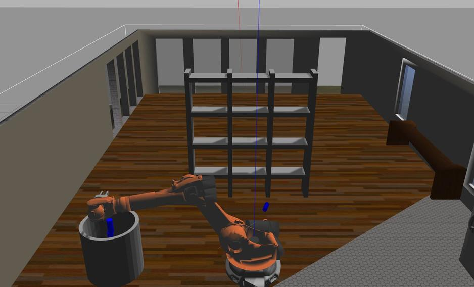
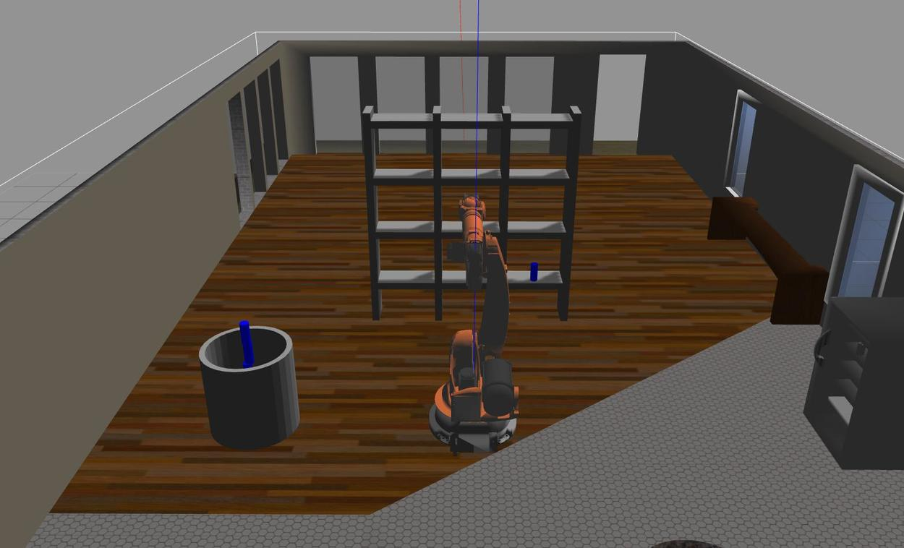
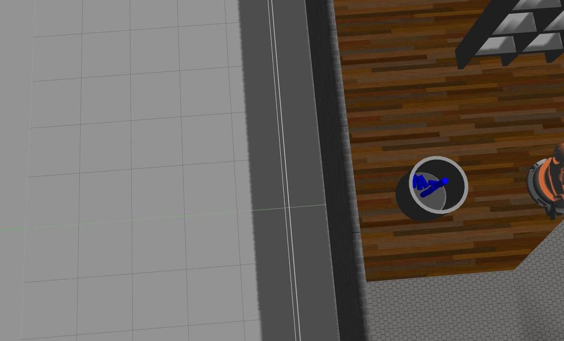

# Kinematics Pick and Place Project

## Kinematic Analysis

### DH Table

DH parameters are extracted from the arm's xacro file, with reference to its layout.  *d1* is composed of 0.33 z offset from base_link to link_1, plus 0.42 z offset from link_1 to link_2.  *a1* is the x offset from link_1 to link_2.  *a2* is the z offset from link_2 to link_3.  *a3* is the z offset from link_3 to link_4.  *d4* is the x offset from link_3 to link_4 plus the x offset from link_4 to link_5.  *d7* requires looking at two sections and is the sum of the x offset from link_5 to link_6 (0.193) and the x offset from link_6 to gripper_link (0.11) for the gripper_joint with type two_finger.

The angles are generally inferred from the arm structure.  *Alpha1* is the angle (-90 deg) between the joint_1 axis (z) and joint_2 axis (y).  Joint_2 and joint_3 axes are parallel so *alpha_2* is 0.  As pointed out in the lesson, theta2 is offset -90 degrees due to the offset between X1 and X2 (relative to the base frame, X2 is in the positive z direction whereas X1 is in the positive x direction.)  *Alpha3* is the angle (-90 deg) from joint_3 axis (y) to joint_4 axis (x).  *Alpha4* is the angle (90 deg) from joint_4 axis (x) to joint_5 axis (y).  *Alpha5* is the angle (-90 deg) from joint_5 axis (y) to joint_6 axis (x).

| Links | alpha(i-1) | a(i-1) | d(i) | theta(i) |
|:---|:---|:---|:---|:---|
| 0->1    | 0 | 0 | 0.75 |   |
| 1->2    | -pi/2 | 0.35 | 0 | q2-pi/2 |
| 2->3 | 0 | 1.25 | 0 |   |
| 3->4 | -pi/2 | -0.054 | 1.50 |   |
| 4->5 | pi/2 | 0 | 0 |   |
| 5->6 | -pi/2 | 0 | 0 |   |
| 6->EE | 0 |0 | 0.303 | 0 |


### Transforms

DH transforms below are in sympy symbolic format with a substitution of the above table after each matrix is defined.  Joint rotations thetaK are shown as qK.  Individual transform matrices are obtained as per the lesson (Forward Kinematics (17)).

```
T0_1 = Matrix([[cos(q1), -sin(q1), 0, a0],
               [sin(q1) * cos(alpha0), cos(q1) * cos(alpha0), -sin(alpha0), -sin(alpha0) * d1],
               [sin(q1) * sin(alpha0), cos(q1) * sin(alpha0), cos(alpha0), cos(alpha0) * d1],
               [0, 0, 0, 1]])
T0_1 = T0_1.subs(s)

T1_2 = Matrix([[cos(q2), -sin(q2), 0, a1],
               [sin(q2) * cos(alpha1), cos(q2) * cos(alpha1), -sin(alpha1), -sin(alpha1) * d2],
               [sin(q2) * sin(alpha1), cos(q2) * sin(alpha1), cos(alpha1), cos(alpha1) * d2],
               [0, 0, 0, 1]])
T1_2 = T1_2.subs(s)

T2_3 = Matrix([[cos(q3), -sin(q3), 0, a2],
               [sin(q3) * cos(alpha2), cos(q3) * cos(alpha2), -sin(alpha2), -sin(alpha2) * d3],
               [sin(q3) * sin(alpha2), cos(q3) * sin(alpha2), cos(alpha2), cos(alpha2) * d3],
               [0, 0, 0, 1]])
T2_3 = T2_3.subs(s)

T3_4 = Matrix([[cos(q4), -sin(q4), 0, a3],
               [sin(q4) * cos(alpha3), cos(q4) * cos(alpha3), -sin(alpha3), -sin(alpha3) * d4],
               [sin(q4) * sin(alpha3), cos(q4) * sin(alpha3), cos(alpha3), cos(alpha3) * d4],
               [0, 0, 0, 1]])
T3_4 = T3_4.subs(s)

T4_5 = Matrix([[cos(q5), -sin(q5), 0, a4],
               [sin(q5) * cos(alpha4), cos(q5) * cos(alpha4), -sin(alpha4), -sin(alpha4) * d5],
               [sin(q5) * sin(alpha4), cos(q5) * sin(alpha4), cos(alpha4), cos(alpha4) * d5],
               [0, 0, 0, 1]])
T4_5 = T4_5.subs(s)

T5_6 = Matrix([[cos(q6), -sin(q6), 0, a5],
               [sin(q6) * cos(alpha5), cos(q6) * cos(alpha5), -sin(alpha5), -sin(alpha5) * d6],
               [sin(q6) * sin(alpha5), cos(q6) * sin(alpha5), cos(alpha5), cos(alpha5) * d6],
               [0, 0, 0, 1]])
T5_6 = T5_6.subs(s)

T6_G = Matrix([[cos(q7), -sin(q7), 0, a6],
               [sin(q7) * cos(alpha6), cos(q7) * cos(alpha6), -sin(alpha6), -sin(alpha6) * d7],
               [sin(q7) * sin(alpha6), cos(q7) * sin(alpha6), cos(alpha6), cos(alpha6) * d7],
               [0, 0, 0, 1]])
T6_G = T6_G.subs(s)
```

The following is a transform matrix from the base link to the gripper using orientation (roll, pitch, yaw) and position (p_x,p_y,p_z) of the gripper.  As for the lesson, the gripper orientation is corrected by rotating about z 180 degrees and about y -90 degrees.

```
Matrix([[1.0*sin(pitch)*cos(roll)*cos(yaw) + 1.0*sin(roll)*sin(yaw), -1.0*sin(pitch)*sin(roll)*cos(yaw) + 1.0*sin(yaw)*cos(roll), 1.0*cos(pitch)*cos(yaw), 1.0*p_x],
        [1.0*sin(pitch)*sin(yaw)*cos(roll) - 1.0*sin(roll)*cos(yaw), -1.0*sin(pitch)*sin(roll)*sin(yaw) - 1.0*cos(roll)*cos(yaw), 1.0*sin(yaw)*cos(pitch), 1.0*p_y],
        [1.0*cos(pitch)*cos(roll), -1.0*sin(roll)*cos(pitch), -1.0*sin(pitch), 1.0*p_z], [0, 0, 0, 1.00000000000000]])
```

To generate this matrix I used the following sympy code:

```
# rotate 180 degrees about Z and -90 degrees about Y
Rz = Matrix([[cos(pi), -sin(pi), 0, 0],
             [sin(pi), cos(pi), 0, 0],
             [0, 0, 1, 0],
             [0, 0, 0, 1]])

Ry = Matrix([[cos(-pi/2), 0, sin(-pi/2), 0],
             [0, 1, 0, 0],
             [-sin(-pi/2), 0, cos(-pi/2), 0],
             [0, 0, 0, 1]])
Rcorr = (Rz * Ry)

#Homogeneous RPY and Position transform
p_x,p_y,p_z = symbols('p_x p_y p_z')
roll,pitch,yaw = symbols('roll pitch yaw')

Rx = Matrix([[1.,0.,0.,0.],
            [0.,cos(roll),-sin(roll),0.],
            [0.,sin(roll),cos(roll),0.],
            [0.,0.,0.,1.]])
Ry = Matrix([[cos(pitch),0.,sin(pitch),0.],
            [0.,1.,0.,0.],
            [-sin(pitch),0.,cos(pitch),0.],
            [0.,0.,0.,1.]])
Rz = Matrix([[cos(yaw),-sin(yaw),0.,0.],
            [sin(yaw),cos(yaw),0.,0.],
            [0.,0.,1.,0.],
            [0.,0.,0.,1.]])
Rt = Matrix([[1.,0.,0.,p_x],
            [0.,1.,0.,p_y],
            [0.,0.,1.,p_z],
            [0.,0.,0.,1.]])
Rhom = Rt*Rz*Ry*Rx*Rcorr
print('Homogeneous {}'.format(simplify(Rhom)))
```

### Inverse Kinematics

The inverse kinematics problem is decomposed into position and orientation of the *wrist* consisting of joints 4, 5, and 6, and located at joint 5.  Computing inverse kinematics results in the six joint angles that place the *end effector* at a specified position and orientation.  Notes show the derivation for *theta1*, *theta2*, and *theta3* implemented in the following code.  These three angles set the *position* of the wrist, and *theta4*, *theta5*, and *theta6* set its *orientation*.

```
A = np.sqrt(s[a3]**2 + s[d4]**2)
B = np.sqrt((np.sqrt(wx**2 + wy**2) - s[a1])**2 + dz**2)
C = s[a2]
v = (A**2 + C**2 - B**2) / (2.0*A*C)
b = np.arccos(v)
# angle adjust component due to a3 (sag in link 4 from project walkthrough)
a_sag = np.arctan2(s[a3], s[d4])
theta3v = (np.pi/2. - b) + a_sag
theta3v = normalize(theta3v)
v = (B**2 + C**2 - A**2) / (2.0*B*C)
a = np.arccos(v)
dxy = np.sqrt(dx**2 + dy**2)
angle = np.arctan2(dz,dxy)
theta2v = np.pi/2. - angle - a
theta2v = normalize(theta2v)
```




```
R3_6_sym[0] = Matrix([[-sin(q4)*sin(q6) + cos(q4)*cos(q5)*cos(q6), -sin(q4)*cos(q6) - sin(q6)*cos(q4)*cos(q5), -sin(q5)*cos(q4)]])
R3_6_sym[1] = Matrix([[sin(q5)*cos(q6), -sin(q5)*sin(q6), cos(q5)]])
R3_6_sym[2] = Matrix([[-sin(q4)*cos(q5)*cos(q6) - sin(q6)*cos(q4), sin(q4)*sin(q6)*cos(q5) - cos(q4)*cos(q6), sin(q4)*sin(q5)]])
```

Using the atan2 technique from Euler Angles from a Rotation Matrix, *theta4* = atan2(R3_6[2,2],-R3_6[0,2]), *theta5* = atan2(sqrt(pow(R3_6[0,2],2) + pow(R3_6[2,2],2), R3_6[1,2]), *theta6* = atan2(-R3_6[1,1],R3_6[1,0]).  To avoid flipping quadrants on *theta4* and *theta6* as *theta5* moves near zero, we can conditionally negate the terms in atan2 to maintain the assumed negative sin quardrant for *theta4* and negative cos quadrant for *theta6*.  That is, observing the minus signs in the equations, these quadrants appear intuitive but the signs actually flip when *theta5* is negative.  (*Extrapolated from a hint on slack channel*)

```
if np.sin(theta5v) < 0:
    theta4s = atan2(-R3_6[2,2],R3_6[0,2])
    theta6s = atan2(R3_6[1,1],-R3_6[1,0])
else:
    theta4s = atan2(R3_6[2,2],-R3_6[0,2])
    theta6s = atan2(-R3_6[1,1],R3_6[1,0])
```

## Implementation

Code implementation follows the detail above.  Additionally, from the lectures there is the process of computing Rrpy using the end effector orientation.  *nx*, *ny*, *nz* from this matrix column 2 are used to project back from the pose position (*px*, *py*, *pz*) to the wrist center, after which *theta1*, *theta2* and *theta3*, can be computed and R0_3 determined.  At this point, R3_6 = inv(R0_3) * Rrpy since R0_6 = Rrpy.  I experienced a lot of trouble with the 'LU' mode for computing the inverse.  Using 'LU' I found that inv(inv(R0_3)) did not return R0_3, whereas omitting 'LU' worked as expected.

```
nx = float(Rrpy[0,2])
ny = float(Rrpy[1,2])
nz = float(Rrpy[2,2])
wx = px - ((d6v + lv) * nx)
wy = py - ((d6v + lv) * ny)
wz = pz - ((d6v + lv) * nz)
```

I ran 10 pick and place operations with one failure and one probable near miss.  Operation number 7 was in transit when the rod collided with the shelf unit and was dropped.  Operation number 9 looked like it came close to the same fate but survived.  Images below show the bin with a stack of rods and several more on the bottom.




